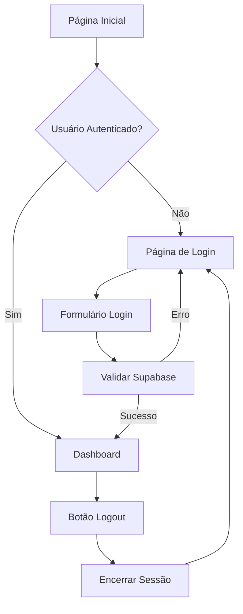

## 1. Product Overview
Sistema de gestão de processos empresariais que necessita implementar autenticação de usuários para permitir acesso seguro e personalizado às funcionalidades. O sistema atual não possui interface de login, impedindo o acesso controlado aos recursos.

## 2. Core Features

### 2.1 User Roles
| Role | Registration Method | Core Permissions |
|------|---------------------|------------------|
| Admin | Convite por e-mail | Acesso completo a todos os módulos |
| Técnico | Convite por e-mail | Acesso limitado conforme permissões atribuídas |
| Cliente | Convite por e-mail | Acesso apenas aos processos relacionados |

### 2.2 Feature Module
Nosso sistema de autenticação consiste nos seguintes elementos:
1. **Página de Login**: formulário com e-mail/senha, botão de entrar, link para recuperação de senha
2. **Proteção de Rotas**: redirecionamento automático para login quando não autenticado
3. **Controle de Sessão**: gerenciamento de estado de autenticação no layout principal
4. **Logout**: funcionalidade para encerrar sessão com atualização de interface

### 2.3 Page Details
| Page Name | Module Name | Feature description |
|-----------|-------------|---------------------|
| Login | Formulário de autenticação | Permitir entrada de e-mail/senha, validar credenciais com Supabase Auth, exibir mensagens de erro, redirecionar após sucesso |
| Login | Botão entrar | Submeter formulário de login, mostrar estado de carregamento, desabilitar durante processamento |
| Layout | Controle de sessão | Detectar estado de autenticação, exibir informações do usuário logado, mostrar botão de logout quando autenticado |
| Layout | Logout | Encerrar sessão no Supabase, limpar estado local, redirecionar para página de login |

## 3. Core Process
**Fluxo de Autenticação:**
1. Usuário acessa o sistema
2. Sistema verifica autenticação via Supabase Auth
3. Se não autenticado, redireciona para página de login
4. Usuário insere e-mail/senha
5. Sistema valida credenciais com Supabase
6. Em caso de sucesso, armazena sessão e redireciona para dashboard
7. Layout atualiza para mostrar usuário logado e opção de logout

## 4. User Interface Design
### 4.1 Design Style
- **Cores primárias**: Azul (#2B6BED) conforme logo existente
- **Cores secundárias**: Cinza claro para backgrounds (#f9fafb)
- **Botões**: Estilo arredondado com sombra sutil
- **Fontes**: Sistema padrão do tailwindcss
- **Layout**: Centralizado com card de login
- **Ícones**: Lucide React icons

### 4.2 Page Design Overview
| Page Name | Module Name | UI Elements |
|-----------|-------------|-------------|
| Login | Formulário | Card centralizado com fundo branco, campos de entrada com bordas arredondadas, botão azul primário, mensagens de erro em vermelho |
| Layout | Header usuário | Avatar circular com imagem do usuário, nome e email em dropdown, botão logout com ícone e texto vermelho |

### 4.3 Responsiveness
Desktop-first com adaptação mobile. O formulário de login deve ser responsivo, ocupando largura total em mobile (max-w-md) e largura fixa em desktop.