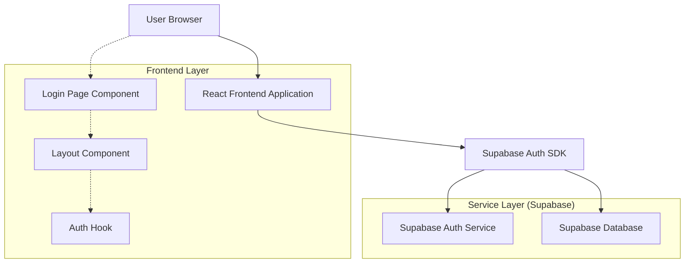
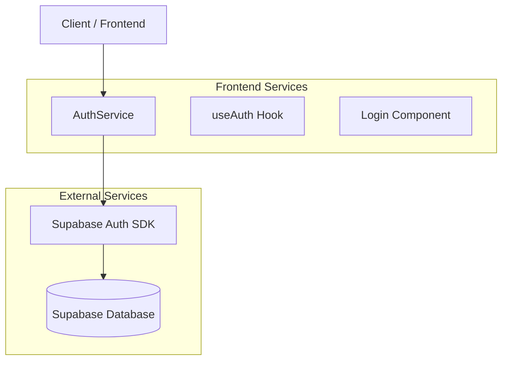
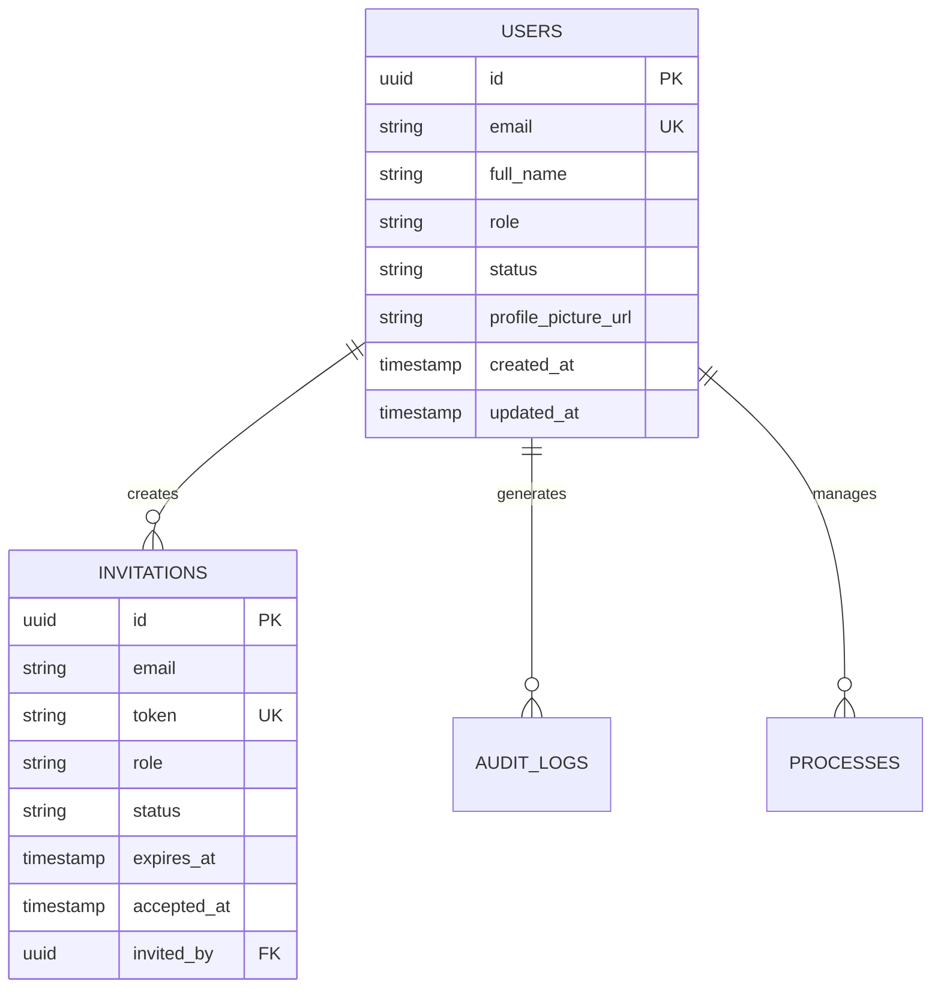

## 1.Architecture design



## 2.Technology Description
- Frontend: React@18 + tailwindcss@3 + vite
- Initialization Tool: vite-init
- Backend: Supabase (Auth + Database)
- Authentication: Supabase Auth (email/password)

## 3.Route definitions
| Route | Purpose |
|-------|---------|
| /login | Página de login, permite autenticação com email/senha |
| / | Dashboard principal (requer autenticação) |
| /dashboard | Dashboard alternativo (requer autenticação) |
| /agenda | Página de agenda (requer autenticação) |
| /processes | Catálogo de processos (requer autenticação) |
| /instances | Processos criados (requer autenticação) |
| /technicians | Gerenciamento de técnicos (requer autenticação) |
| /auditlog | Log de auditoria (requer autenticação) |
| /reports | Relatórios (requer autenticação) |
| /accept-invite | Aceitar convite de acesso (público) |

## 4.API definitions
### 4.1 Core API

Autenticação via Supabase Auth
```
POST /auth/v1/token
```

Request:
| Param Name| Param Type  | isRequired  | Description |
|-----------|-------------|-------------|-------------|
| email     | string      | true        | Email do usuário |
| password  | string      | true        | Senha do usuário |

Response:
| Param Name| Param Type  | Description |
|-----------|-------------|-------------|
| access_token | string  | Token JWT de acesso |
| refresh_token | string | Token para renovação |
| user      | object      | Dados do usuário autenticado |
| expires_in | number     | Tempo de expiração em segundos |

Example
```json
{
  "email": "usuario@example.com",
  "password": "senha123"
}
```

## 5.Server architecture diagram


## 6.Data model

### 6.1 Data model definition


### 6.2 Data Definition Language
User Table (users)
```sql
-- create table
CREATE TABLE users (
    id UUID PRIMARY KEY DEFAULT gen_random_uuid(),
    email VARCHAR(255) UNIQUE NOT NULL,
    full_name VARCHAR(255),
    role VARCHAR(50) DEFAULT 'technician' CHECK (role IN ('admin', 'technician', 'client')),
    status VARCHAR(20) DEFAULT 'active' CHECK (status IN ('active', 'inactive', 'pending')),
    profile_picture_url TEXT,
    created_at TIMESTAMP WITH TIME ZONE DEFAULT NOW(),
    updated_at TIMESTAMP WITH TIME ZONE DEFAULT NOW()
);

-- create index
CREATE INDEX idx_users_email ON users(email);
CREATE INDEX idx_users_role ON users(role);
CREATE INDEX idx_users_status ON users(status);

-- grant permissions
GRANT SELECT ON users TO anon;
GRANT ALL PRIVILEGES ON users TO authenticated;
```

Invitations Table (invitations)
```sql
-- create table
CREATE TABLE invitations (
    id UUID PRIMARY KEY DEFAULT gen_random_uuid(),
    email VARCHAR(255) NOT NULL,
    token VARCHAR(255) UNIQUE NOT NULL,
    role VARCHAR(50) DEFAULT 'technician',
    status VARCHAR(20) DEFAULT 'pending' CHECK (status IN ('pending', 'accepted', 'expired')),
    expires_at TIMESTAMP WITH TIME ZONE NOT NULL,
    accepted_at TIMESTAMP WITH TIME ZONE,
    invited_by UUID REFERENCES users(id),
    created_at TIMESTAMP WITH TIME ZONE DEFAULT NOW()
);

-- create index
CREATE INDEX idx_invitations_token ON invitations(token);
CREATE INDEX idx_invitations_email ON invitations(email);
CREATE INDEX idx_invitations_status ON invitations(status);

-- grant permissions
GRANT SELECT ON invitations TO anon;
GRANT ALL PRIVILEGES ON invitations TO authenticated;
```